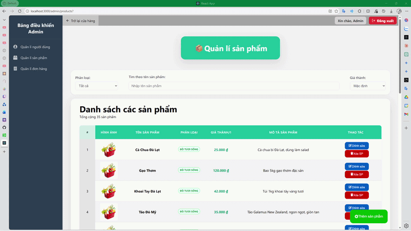
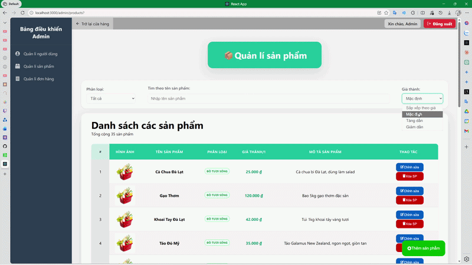
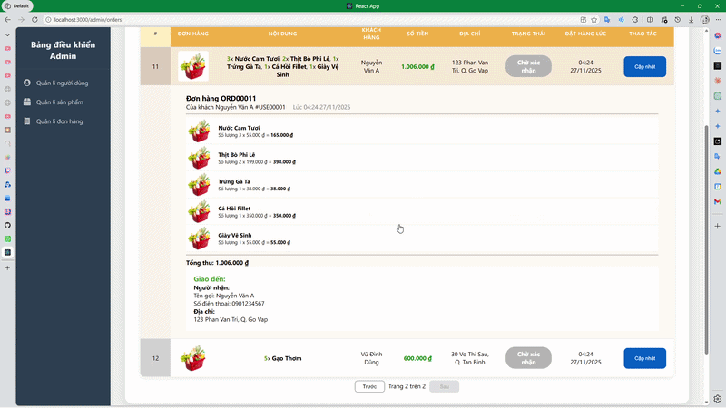
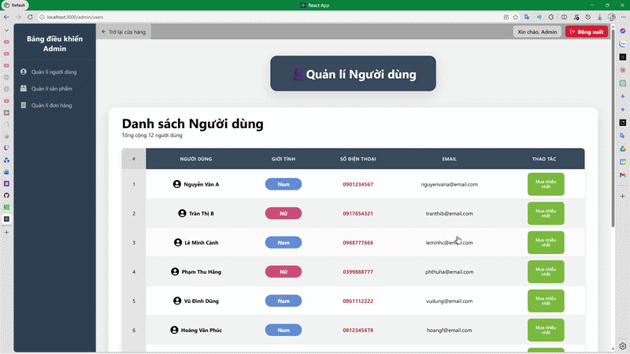

# FullStackEcomAdmin

A full-stack admin dashboard for managing an e-commerce platform. Built with React on the frontend, Node.js/Express on the backend, and SQL Server as the database.

---

## 📸 Screenshots

- **Product Management** — Create, edit, and delete products including naming, pricing, and description.


- **Order Management** — View all customer orders and update their status (e.g. pending, shipped, delivered).

- **User Management** — View users info and top purchased products.


---

## ✨ Features

- **Authentication & Role Management** — Secure login system with role-based access control to restrict what different admin users can view and do.
- **Product Management** — Create, update, and delete products including details like name, price, category, stock quantity, and images.
- **Order Management** — View and manage customer orders, update order statuses, and track fulfilment.
- **User & Customer Management** — Browse and manage registered customer accounts.

---

## 🗄️ Database

The project uses **Microsoft SQL Server** as its relational database.

The schema covers the core e-commerce entities: users, products, categories, orders, and order items. Relationships are enforced through foreign keys (e.g. each order belongs to a user, each order item references a product).

The database is consumed by the Express backend via a Node.js SQL Server driver (e.g. `mssql`). The API layer handles all queries — the frontend never talks to the database directly. Each Express route corresponds to a set of SQL queries that read or write the relevant tables, and the results are returned to the React frontend as JSON.

---

## 🛠️ Tech Stack

| Layer | Technology |
|-------|------------|
| Frontend | React |
| Backend | Node.js + Express |
| Database | Microsoft SQL Server |

---

## 🚀 Getting Started

### Prerequisites

Make sure you have the following installed:

- [Node.js](https://nodejs.org/) (v16 or higher recommended)
- [npm](https://www.npmjs.com/) or [yarn](https://yarnpkg.com/)
- [Microsoft SQL Server](https://www.microsoft.com/en-us/sql-server) (local instance or remote)
- [SQL Server Management Studio (SSMS)](https://learn.microsoft.com/en-us/sql/ssms/download-sql-server-management-studio-ssms) _(optional, for browsing the database)_

---

### 1. Clone the Repository

```bash
git clone https://github.com/DangHoangThanh/FullStackEcomAdmin.git
cd FullStackEcomAdmin
```

---

### 2. Set Up the Database

1. Open SSMS (or your preferred SQL client) and connect to your SQL Server instance.
2. Run the provided SQL script to create the database and seed initial data:

```sql
-- Example
CREATE DATABASE EcomAdmin;
USE EcomAdmin;
-- Then run the schema and seed scripts from /database
```

> 📁 Look for `.sql` files in the `/database` folder of this repo.

---

### 3. Configure the Backend

Navigate to the backend directory and install dependencies:

```bash
cd server
npm install
```

Create a `.env` file in the `server` folder with your SQL Server connection details:

```env
DB_SERVER=localhost
DB_DATABASE=EcomAdmin
DB_USER=your_sql_username
DB_PASSWORD=your_sql_password
DB_PORT=1433

JWT_SECRET=your_jwt_secret
PORT=5000
```

> If using Windows Authentication instead of SQL login, update the `mssql` config in the connection file to use `trusted_connection: true` and remove the user/password fields.

Start the backend server:

```bash
npm run dev
```

The API will be available at `http://localhost:5000`.

---

### 4. Configure the Frontend

Navigate to the frontend directory and install dependencies:

```bash
cd ../client
npm install
```

Create a `.env` file in the `client` folder:

```env
REACT_APP_API_URL=http://localhost:5000
```

Start the frontend:

```bash
npm start
```

The app will open at `http://localhost:3000`.

---

## 📁 Project Structure

```
FullStackEcomAdmin/
├── client/          # React frontend
│   ├── src/
│   │   ├── components/
│   │   ├── pages/
│   │   └── ...
├── server/          # Node.js + Express backend
│   ├── routes/
│   ├── controllers/
│   ├── config/      # Database connection
│   └── ...
└── database/        # SQL scripts (schema + seed data)
```
